# BlindSpotMoat (codename: NULLTRACK)

<p align="center">
  
</p>

A falsifiable analysis engine that tests one question:

> *In manufacturing brownfield retrofit, is there a set of open-source production
> assets that policy and procurement instruments structurally cannot "see" — and
> if so, does that illegibility constitute a **measurable but finite** economic
> arbitrage, or merely a phantom?*

**This is a research/analysis instrument, not a product and not a trading
system.** It is engineered to refuse to assert a conclusion it cannot prove with
audited evidence. On the data publicly available today, it correctly returns
**`phantom_moat`** — and that is the headline result, explained below.

---

## ⚠️ Disclaimer (read before anything else)

- **Not investment advice.** The codebase contains a "monetization signal"
  concept (a long/short framing referencing real listed companies). It is
  **gated off and voided** in every current run and is present only as a
  falsifiable hypothesis (H4/H7), not a recommendation. Nothing here is financial
  advice or a solicitation. Do not act on it.
- **No empirical claim is made.** All numeric inputs are `public_unaudited` /
  `self_reported`. Per the engine's honesty invariant they are *narrative*, not
  evidence. The project makes **no claim** that any company or open-source
  project is over- or under-valued.
- **Research artifact.** Outputs are illustrative of a *methodology*. They are
  explicitly **not** certified findings.

---

## The one-paragraph summary

BlindSpotMoat models manufacturing investment as two tracks: **Track P**
(policy-visible: subsidized, listed, audited) and **Track O** (open-source
brownfield retrofit: near-zero capital, invisible to procurement frameworks). It
asks whether Track O's illegibility is a real, finite arbitrage. The engine only
accepts data classed `audited` as empirical evidence. The audited evidence needed
to prove the claim — production-scale deployment telemetry and full-lifecycle
cost — **does not exist in the public domain**, independently confirmed by six
web-enabled AIs with zero fabrication. The engine therefore halts at its first
gate and returns **`phantom_moat`**: the idea is *neither accepted nor
discarded*, but held as **evidence-blocked provisional**. Advancing it requires
non-public field research, not more analysis.

## Why `phantom_moat` is the point, not a failure

The engine's first gate (**S0** = hypotheses H0 & H5) requires ≥10 Track O
assets with **audited** production-scale deployment evidence. That evidence is
structurally unavailable publicly (shadow-IT budgets, air-gapped OT networks,
integrator NDAs). A naive tool would have "passed" using GitHub stars and README
payback claims. This one deliberately will not. `phantom_moat` means:

> *"The methodology runs end-to-end, but the claim cannot be certified from
> public data. Here is exactly what is missing and where it lives."*

## Quickstart

```bash
# Python 3.10+ ; no dependencies (standard library only)
cd BlindSpotMoat

python -m engine --mode dry-run     # validate data contracts, gates, thresholds
python -m engine --mode execute     # run the full pipeline (human-readable)
python -m engine --mode execute --json   # machine-readable
```

Expected current output: `verdict = phantom_moat`, `gating_halt = H0/H5`,
`H0 FALSIFIED` (0 audited production-scale assets), `H5 INCONCLUSIVE`,
monetization signal voided, legal-standing layer `fail_closed_ok = True`.

## Repository map

```
README.md                         ← you are here
LICENSE                           ← MIT
docs/
  TECHNICAL_SPECIFICATION.md      ← master reference (read this to fully understand)
  DESIGN.md                       ← architecture: PGF Gantree + nodes + dependency graph
  HYPOTHESES.md                   ← pre-registered H0–H7 (thresholds, gating order)
  REVIEW_SYNTHESIS.md             ← 7-AI adversarial design review → adopted changes
  DATA_COLLECTION.md              ← 6-AI data collection method + findings + the gap
engine/                           ← the Python implementation (stdlib only)
  __main__.py contracts.py harness.py pipeline.py errors.py
  nodes/  …                       ← one module per Gantree node
  fixtures/  …                    ← vintage-snapshot data (6-AI cross-verified, public_unaudited)
evidence/                         ← auditable primary sources behind the headline claims
  design_review/                  ←   the 7-AI review prompt + 7 raw responses (7/7 revise)
  data_collection/                ←   the 6-AI collection prompt + raw responses (6/6, fabricated=0)
```

> Korean working originals and raw PGF scratch are kept locally under `_legacy/`
> for provenance; they are intentionally excluded from the published repository
> (English `docs/` + `evidence/` supersede them).

> **Start with `docs/TECHNICAL_SPECIFICATION.md`.** It is self-contained: an
> engineer or AI seeing this project for the first time can understand it, run
> it, interpret it, and know how to advance it from that one document.

## How this project reached its current state

1. **Generated** by the A3IE idea pipeline; selected via cross-model-certified
   surprise (idea `IDEA-20-02`, lens "delete the scarce resource").
2. **Adversarially reviewed** by 7 independent AIs → 7/7 "revise". Nine changes
   adopted (`docs/REVIEW_SYNTHESIS.md`): moat redefined as a *finite* window,
   the self-protection layer abandoned, set-difference replaced by a graded
   visibility graph, hypotheses re-registered with explicit thresholds.
3. **Implemented** as this engine (design → plan → execute → verify).
4. **Data-collected** by 6 independent web AIs (`fabricated_values=0`, 6/6):
   the audited evidence required is structurally unavailable publicly
   (`docs/DATA_COLLECTION.md`).
5. **Verdict**: `phantom_moat` (empirically robust). State: *evidence-blocked
   provisional*. Only a non-public field-research track can change this.

Steps 2 and 4 are not claims to take on trust — the raw prompts and every raw
independent response are preserved verbatim under [`evidence/`](evidence/) so the
`7/7 revise` and `6/6 fabricated=0` results can be audited and re-run.

## State & next step

The idea is **not refuted** and **not accepted** — it is *blocked on evidence
that does not exist in public*. The single path to a different verdict is the
field-research track (NDA integrator interviews, factory site visits,
certification-body data) detailed in `docs/DATA_COLLECTION.md §4`. That is a
human/commercial-data effort, out of scope for any AI or public-web collection.

## License

MIT — see [`LICENSE`](LICENSE). © 2025–2026 sadpig70.
