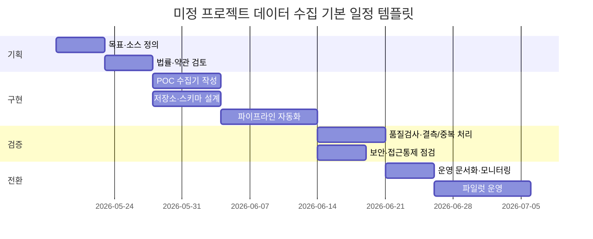

# 미정 프로젝트의 데이터 수집 가능성 평가 보고서

## 경영진 요약

사용자 프로젝트의 목표 데이터 유형, 수집 대상 소스, 규모, 법적 관할, 일정, 예산이 모두 미정인 상태에서도 **데이터 수집은 대체로 가능**하다고 판단된다. 다만 이 결론은 “무조건 가능”이 아니라, **소스별 권리 확보**, **적절한 접근 방식 선택**, **품질·메타데이터 설계**, **개인정보·계약·저작권 검토**, **운영비용 통제**가 충족될 때의 조건부 가능성이다. 특히 공식 API와 공개 데이터셋은 비교적 저위험·고품질 경로인 반면, 웹 스크래핑은 기술적으로는 가능해도 robots.txt, 이용약관, 저작권, 개인정보, 차단 우회 여부에 따라 위험도가 급격히 상승한다. citeturn32search0turn4search1turn25search0turn41search2turn41search3turn31search3

한국 기준으로는 **개인정보보호법 PIPA와 개인정보보호위원회 PIPC의 집행 리스크를 전제로 설계**해야 한다. PIPC는 Meta의 민감정보 무단 수집·활용에 대해 2024년 216.2억 원의 과징금을 부과했고, 2025년에는 DeepSeek의 한국 내 신규 다운로드를 개인정보보호 규정 미준수 사유로 중단시켰다. 즉 “공개된 곳에서 보였으니 수집해도 된다”는 접근은 한국 실무에서 매우 위험하다. citeturn31news1turn31news2turn31news0

실행 우선순위는 명확하다. **API 우선 → 공식 공개데이터/다운로드 우선 → 계약된 상용 데이터 → 파트너/사내 시스템 연동 → 마지막 수단으로 제한적 스크래핑**이 가장 합리적이다. 이 순서는 법적 안정성, 변경 내성, 스키마 안정성, 운영 가능성 측면에서 가장 유리하다. W3C의 DCAT은 데이터셋 메타데이터 상호운용을, Schema.org Dataset은 웹상 데이터셋 기술을, OpenAPI는 API의 기계판독형 명세를 지원해 수집 자동화와 운영 안정성에 직접 도움이 된다. citeturn36search4turn36search3turn36search2

실무적으로 보면, **소규모 공개 웹 수집**은 며칠~1주 수준의 POC로 가능하고, **중간 규모 API 수집**은 2~6주, **대규모 엔터프라이즈 연동**은 6~16주 이상이 일반적이다. 비용은 저장 자체보다 소스 라이선스, 인증 연동, CDC·스케줄링·모니터링·보안 통제가 더 큰 비중을 차지하는 경우가 많다. 객체 스토리지는 상대적으로 저렴하지만, 엔터프라이즈급 ETL·오케스트레이션·데이터 웨어하우스 운영은 빠르게 비용이 커질 수 있다. citeturn34search0turn20search5turn20search4turn34search4turn42search0turn42search4

## 전제와 판단 기준

이번 평가는 다음 다섯 가지가 **명시되지 않은 상태**를 전제로 한다.

| 미정 항목 | 현재 상태 | 평가 방식 |
|---|---|---|
| 대상 데이터 유형 | 텍스트/이미지/센서/거래/로그 등 미정 | 유형별 수집 가능성과 제약을 범주형으로 제시 |
| 대상 소스 | 웹사이트/API/공개데이터/민간DB/사내시스템 미정 | 소스 클래스별 접근성·위험·비용 비교 |
| 규모 | 소/중/대규모 미정 | 세 가지 시나리오 템플릿으로 분기 |
| 법적 관할 | 한국만인지, EU/미국 포함인지 미정 | 한국 PIPA를 기본, GDPR 가능성 별도 반영 |
| 일정·예산 | 미정 | 범위 추정과 비용 가정 명시 |

이 보고서의 핵심 판단 기준은 네 가지다. **권리**가 있는가, **지속 가능한 기술 접근**이 가능한가, **원하는 품질을 맞출 수 있는가**, **운영비용이 가치보다 낮은가**이다. 이 네 가지 가운데 하나라도 빠지면 “수집은 된다”가 아니라 “일회성으로 긁을 수는 있지만 운영 가능한 데이터 자산은 되지 않는다”로 해석해야 한다. 한국에서는 PIPA와 PIPC, EU 거주자 데이터가 포함될 경우 GDPR의 역외적용 가능성을 먼저 검토해야 한다. GDPR은 2018년 5월 25일부터 적용되며, EU 외부 조직이라도 EU 내 개인에게 상품·서비스를 제공하거나 행동을 모니터링하면 적용될 수 있다. citeturn32search0turn4search1

실무적으로는 “가능 여부”를 한 번에 묻기보다, 아래의 질문을 소스별로 체크해야 한다.  
**이 소스는 공개인가, 인증이 필요한가, 계약이 필요한가, 개인정보가 포함되는가, 저작권/DB권/이용약관 제한이 있는가, 스키마와 메타데이터가 안정적인가, 변경 주기를 감당할 수 있는가.** 이 질문에 대한 답이 정리되면 미정 프로젝트도 빠르게 구체화된다. citeturn25search0turn31search3turn31news1

## 어떤 데이터가 가능한가

미정 프로젝트에서 고려할 수 있는 데이터는 보통 **문서형 텍스트**, **정형/반정형 테이블**, **이미지·영상**, **센서·IoT 시계열**, **지리·공간 데이터**, **거래·행동 로그** 여섯 범주로 정리할 수 있다. 수집 전략은 데이터 형태보다 **출처와 권리 구조**가 더 중요하지만, 형식별로 적합한 파이프라인과 검증 방식이 다르다. 예를 들어 문서형 데이터는 PDF/HTML/JSON/XML 파싱과 메타데이터 표준화가 중요하고, 센서·로그는 시계열 정합성·지연·결측 관리가 중요하며, 이미지·영상은 라이선스와 라벨링 품질이 병목이 되기 쉽다. W3C DCAT과 Schema.org Dataset은 데이터셋의 설명·배포 포맷·접근점·라이선스 같은 메타데이터를 구조적으로 기록하는 데 유용하고, OpenAPI는 API 기반 수집에서 파라미터·응답·버전 관리의 기준점이 된다. citeturn36search4turn36search3turn36search2

한국어 소스 우선이라는 조건을 반영하면, 대표적인 공개·공식 후보군은 다음과 같이 볼 수 있다. **통계·거시·정형 데이터**는 통계청 KOSIS와 한국은행 ECOS가 강력한 출발점이다. 실제로 KRED 연구는 한국 공개 거시데이터를 구성할 때 KOSIS와 ECOS를 핵심 공식 소스로 활용했다. **AI/ML용 한국어 데이터**는 AI Hub가 대표적이며, KoSpeech 연구는 AI Hub가 제공한 1,000시간 규모 한국어 음성 코퍼스 KsponSpeech를 활용했다. 이런 종류의 소스는 미정 프로젝트가 텍스트/음성/분석형 데이터 어느 쪽으로 가더라도 초기 탐색 가치가 높다. citeturn38academia0turn37academia0

아래 표는 데이터 유형별 예시와 권장 접근 경로를 정리한 것이다.

| 데이터 유형 | 예시 | 우선 접근 경로 | 주된 포맷 | 핵심 검증 포인트 |
|---|---|---|---|---|
| 문서형 텍스트 | 법령, 공시, 보도자료, FAQ, 정책문서 | 공식 API/다운로드, 없으면 제한적 HTML 수집 | HTML, PDF, XML, JSON | 버전, 발행일, 원문 보존, OCR 최소화 |
| 정형/반정형 | 통계, 가격, 재고, 이벤트, 상품 카탈로그 | 공식 API, CSV/XLSX 다운로드, DB 덤프 | CSV, XLSX, JSON, Parquet | 스키마 안정성, 코드북, 단위, 키 중복 |
| 이미지·영상 | 상품 이미지, 위성/지도 타일, 제조 비전 데이터 | 라이선스 명확한 공개셋, 계약형 공급자 | JPG, PNG, MP4, WebP | 저작권, 라벨 품질, 해상도, EXIF |
| 센서·IoT 시계열 | 온도, 진동, GPS, 장비 상태 | MQTT/Kafka/웹훅/API/파일 배치 | JSON, CSV, Avro, Parquet | 타임스탬프 정합성, 지연, 결측, 재전송 |
| 거래/행동 로그 | 주문, 클릭, 세션, CRM 이벤트 | 사내 DB, CDC, SaaS API | JSON, CSV, DB 레코드 | 개인정보, 보존정책, 이벤트 순서 |
| 공간 데이터 | 주소, 좌표, 행정구역, POI | 정부 API, 공공 데이터셋, 상용 지도 API | GeoJSON, Shapefile, JSON | 좌표계, 라이선스, 갱신주기 |

대표적인 한국 공식 링크는 아래처럼 바로 출발점을 만들 수 있다.

| 항목 | 공식 링크 |
|---|---|
| 공공데이터포털 | https://www.data.go.kr/ |
| KOSIS OpenAPI | https://kosis.kr/openapi/index/index.do |
| 한국은행 ECOS API | https://ecos.bok.or.kr/api/ |
| Open DART | https://opendart.fss.or.kr/ |
| AI Hub | https://www.aihub.or.kr/ |
| 국가법령정보센터 | https://www.law.go.kr/ |
| 개인정보보호위원회 | https://www.pipc.go.kr/ |
| GDPR 원문 | https://eur-lex.europa.eu/eli/reg/2016/679/oj |

## 데이터 소스와 접근 방식

가장 안전한 소스는 **공식 API와 공식 공개데이터셋**이다. 이런 소스는 보통 접근 조건, 버전, 파라미터, 응답 포맷, 메타데이터가 문서화되어 있고, 수집 파이프라인이 깨졌을 때 원인 파악도 쉽다. 반면 **공개 웹 HTML**은 사람이 보기 위한 인터페이스이기 때문에 DOM 변경, JS 렌더링, anti-bot, 로케일 차이, 페이지네이션 구조 변경에 취약하다. **사내 시스템과 파트너 시스템**은 품질이 가장 높을 수 있지만 반드시 권한, 계약, 식별자 매핑, 변경 데이터 캡처 설계가 선행되어야 한다. citeturn36search2turn35search0turn42search0turn34search4

아래 비교표는 소스 클래스별 실무 판단에 가장 유용한 프레임이다.

| 소스 유형 | 접근 방식 | 법적 위험 | 예상 품질 | 비용 수준 |
|---|---|---|---|---|
| 공식 공개 API | API key/OAuth/REST 호출 | 낮음~중간 | 높음 | 낮음~중간 |
| 공식 공개 데이터셋 다운로드 | CSV/XLSX/ZIP/Parquet 일괄 수집 | 낮음 | 높음 | 낮음 |
| 상용 API/데이터벤더 | 계약, API, SFTP, 라이선스 | 중간 | 높음 | 중간~높음 |
| 사내/파트너 시스템 | DB 연결, CDC, 웹훅, 파일배치 | 낮음~중간 | 매우 높음 | 중간~높음 |
| 공개 웹 HTML | requests/Scrapy/브라우저 자동화 | 중간~높음 | 중간 | 낮음~중간 |
| 인증 필요한 웹/앱 | 브라우저 자동화, 세션, MFA | 높음 | 중간 | 중간~높음 |

API 접근에서는 **인증 방식과 운영 제약**을 먼저 확인해야 한다. 가장 흔한 방식은 **API key**와 **OAuth 2.0**이다. API key는 프로젝트·클라이언트 식별에 흔히 쓰이지만, 키 노출과 장기 유효성 때문에 상대적으로 약한 방식이며, OAuth 2.0은 제3자 앱에 사용자 비밀번호를 넘기지 않고 위임 접근을 제공하는 업계 표준이다. 따라서 사용자 계정 데이터나 파트너 시스템 연동이 포함되면 API key 단독보다 OAuth 2.0 또는 그에 준하는 위임·토큰 기반 방식이 선호된다. 구현 전에는 호출량 제한, burst limit, retry 정책, page/offset/cursor pagination, 버전 정책, 삭제된 레코드 표현 방식까지 문서에서 확인해야 한다. citeturn44search0turn43search0

웹 스크래핑은 기술적으로는 넓은 범위에서 가능하지만, **합법성·지속성·운영성은 별개 문제**다. robots.txt는 원래 웹사이트가 크롤러에 접근 규칙을 알리는 표준이며 2022년에 RFC 9309로 공식화되었지만, 기본적으로 **자발적 준수**에 의존한다. 최근 대규모 측정 연구도 스크레이퍼들이 robots নির্দেশ을 선택적으로만 지키는 경향이 있음을 보였기 때문에, robots.txt는 “필수 확인 항목”이지 “법적 면책장치”는 아니다. citeturn25search0turn31academia10turn31academia8

법적 판단은 특히 조심해야 한다. 미국 판례 기준으로는 **공개 프로필 같은 공개 페이지 접근이 곧바로 CFAA 위반으로 확정되는 것은 아니다**는 hiQ 계열 판단이 있지만, 이것은 미국 특정 맥락의 이야기이고, 반대로 **차단 통지 후 IP 우회**처럼 명시적 기술 차단을 넘는 행위는 3Taps 사건에서 CFAA 리스크를 키웠다. 또한 robots.txt를 안 썼다고 해서 이용허락이 생기는 것은 아니라는 점은 Associated Press v. Meltwater 맥락에서 확인된다. 그래서 실무 원칙은 단순하다. **공개 페이지라도 개인정보·저작권·약관 검토 없이는 대규모 수집을 자동 승인하지 말고, 명시적 차단·로그인 회피·세션 탈취·우회는 금지**하는 것이 안전하다. citeturn41search2turn41search1turn41search3turn41news0turn31search3

## 수집 실행의 기술·운영 설계

좋은 수집 시스템은 “얼마나 많이 모았는가”보다 **무엇을, 어떤 근거로, 얼마나 재현 가능하게 모았는가**가 중요하다. 따라서 데이터 레코드 본문 외에 최소한 다음 메타데이터를 함께 저장해야 한다. **수집 시각, 원본 URL/엔드포인트, 응답 상태, 라이선스/약관 버전, 스키마 버전, 파싱 버전, 원문 해시, 소스 식별자, 갱신주기, 삭제/수정 여부**다. W3C DCAT은 데이터셋·배포판·서비스 메타데이터를 상호운용 가능하게 기술하도록 설계되었고, Schema.org Dataset은 웹 데이터셋의 발견성을 높이며, OpenAPI는 API 명세를 자동화·검증 가능한 형태로 다루게 해 준다. citeturn36search4turn36search3turn36search2

저장소 선택은 규모와 질의 패턴에 따라 나눠야 한다. **소규모**에서는 SQLite나 PostgreSQL만으로도 충분한 경우가 많고, 특히 PostgreSQL은 JSON/JSONB와 외부 데이터 래퍼를 지원해 반정형 데이터와 연동에 유리하다. **중규모**에서는 PostgreSQL + 객체 스토리지 또는 서버리스 웨어하우스가 무난하며, BigQuery는 대규모 분석용 관리형 서버리스 웨어하우스라는 점이 강점이다. **대규모**에서는 객체 스토리지 기반 데이터 레이크를 두고, Apache Iceberg 같은 테이블 포맷으로 다중 엔진 분석을 병행하는 구조가 좋다. S3는 데이터 레이크·백업·아카이브에 널리 쓰이고, 매우 장기 보관은 Glacier 계층이 비용 효율적이다. citeturn35search0turn20search4turn20search5turn36search0turn34search0

ETL/ELT 운영에서는 **오케스트레이션·싱크·변환**을 분리하면 안정성이 높아진다. Airflow는 DAG 기반 워크플로 오케스트레이션에 강하고, Airbyte는 다양한 소스에서 데이터 웨어하우스·레이크·DB로 동기화하는 오픈소스/클라우드/하이브리드 통합 플랫폼이며, dbt는 웨어하우스 내부 변환 계층을 코드화하는 데 적합하다. 이 조합은 “수집”, “적재”, “정제”, “모델링”, “검증”을 분리하여 운영하는 데 실용적이다. citeturn42search0turn34search4turn42search4turn42news1


도구 선택은 가능한 한 **가벼운 것부터 시작**하는 편이 좋다. Python 기준으로 `requests`는 HTTP 호출, `BeautifulSoup`은 HTML/XML 파싱, `Scrapy`는 대규모 크롤링, `Playwright`와 `Selenium`은 JS 렌더링·브라우저 상호작용이 필요한 경우에 적합하다. Selenium은 WebDriver 표준 생태계의 중심이고, Playwright는 Chromium/Firefox/WebKit을 한 API로 다룰 수 있어 현대적인 서비스 수집에 자주 쓰인다. R에서는 `httr2`, `jsonlite`, `rvest`가 기본적인 API·JSON·스크래핑 조합으로 유용하다. citeturn12search1turn11search2turn12search0turn21search0turn21search1

짧은 도구 선택 표를 덧붙이면 다음과 같다.

| 도구 | 적합한 상황 | 피해야 할 상황 |
|---|---|---|
| requests | 정적 API/HTML, 빠른 POC | JS 렌더링 필수 페이지 |
| BeautifulSoup | HTML 파싱, selector 기반 추출 | 대규모 병렬 수집 자체 |
| Scrapy | 대규모 크롤링, 큐/재시도/파이프라인 | 단건 API 호출만 있는 프로젝트 |
| Playwright | JS/SPA, 로그인 후 DOM 상호작용 | 공개 정적 페이지만 수집할 때 |
| Selenium | 브라우저 호환성·표준 WebDriver 필요 | 가벼운 POC에서 과한 경우 |
| PostgreSQL | 중소규모 운영 저장소, JSONB 활용 | 초대규모 오브젝트 레이크 대체 |
| Airflow | 스케줄·의존성·운영 가시성 중요 | 단순 cron 수준 작업만 있을 때 |
| Airbyte | 다수 SaaS/API 소스 동기화 | 매우 특수한 커스텀 추출만 있을 때 |
| dbt | 웨어하우스 내 변환 표준화 | 원본 수집기 자체로 사용하려 할 때 |

## 법률·윤리·컴플라이언스

한국에서 개인정보가 조금이라도 개입될 가능성이 있으면 **PIPA 중심 설계**가 기본이다. PIPC는 한국의 국가 데이터 보호 감독기관이며, 한국 개인정보 규제의 집행 중심이다. 최근 집행 사례를 보면, Meta는 Facebook 사용자 약 98만 명의 종교·정치관·성적 지향 등 민감정보를 적법한 동의 없이 수집·광고주에게 제공한 문제로 2024년 제재를 받았고, DeepSeek는 2025년 한국 개인정보 규정 미준수 문제로 신규 다운로드가 중단되었다. 즉 데이터 수집은 “기술”이 아니라 **법적 근거와 목적 제한**에서 먼저 판정되어야 한다. citeturn32search0turn31news1turn31news2turn31news0

EU 거주자 데이터가 포함되거나 EU 내 개인의 행동을 모니터링하는 서비스라면 **GDPR 가능성도 열어둬야** 한다. GDPR은 2018년 5월 25일부터 적용되며, EU 밖 조직에도 적용될 수 있다. 또한 GDPR의 pseudonymization은 단순 치환을 넘어, 별도 보관되는 추가 정보 없이는 특정 개인에게 귀속될 수 없어야 하는 개념이므로, “가명처리했으니 개인정보가 아니다”라고 단정하면 위험하다. 가명정보도 여전히 규율 대상일 수 있다. citeturn4search1turn32search2

윤리적으로는 최소한 다음 기준이 필요하다.  
첫째, **목적 외 수집 금지**.  
둘째, **필요 최소한만 수집**.  
셋째, **민감정보·아동정보는 특별 취급**.  
넷째, **삭제 요청·정정 요청·접근권 대응 절차 확보**.  
다섯째, **출처와 라이선스의 감사 가능성 확보**.  
여섯째, **차단 우회·우발적 계정 오남용·rate-limit 파괴 금지**다.  
특히 사람의 행동흔적, 직무 로그, 위치, 구매이력, 커뮤니케이션 기록은 여러 소스를 결합할 때 재식별 위험이 커지므로, 공개 조각을 합치면 민감정보가 되는 **mosaic effect**를 항상 염두에 둬야 한다. citeturn32search3turn31news1turn32search2

컴플라이언스 체크리스트도 미리 고정하는 편이 좋다.

| 항목 | 최소 요구사항 |
|---|---|
| 법적 근거 | 동의, 계약, 정당한 이익, 법령상 근거 중 무엇인지 문서화 |
| 라이선스 | API ToS, 데이터셋 라이선스, 재배포 허용 여부 확인 |
| 개인정보 | 개인식별자/가명정보/민감정보 여부 분류 |
| 보존정책 | 원본·정제본 보존기간, 삭제정책, 백업정책 명시 |
| 접근통제 | IAM/RBAC, 키 관리, 감사로그 |
| 데이터 주체 대응 | 열람·정정·삭제 요청 대응 프로세스 |
| 국외 이전 | 클라우드 지역, 국외 이전 고지/근거 검토 |
| 감사성 | 수집 스크립트 버전, 원본 해시, 재실행 가능성 기록 |

## 규모별 비용 추정과 시나리오 템플릿

비용은 소스별로 매우 다르기 때문에 아래 범위는 **가정 기반 추정치**다. 가정은 다음과 같다. 작은 프로젝트는 무료 또는 저가 공개 소스 중심, 중간 프로젝트는 API 인증·모니터링·관리형 DB가 포함, 큰 프로젝트는 엔터프라이즈 연결·보안·오케스트레이션·웨어하우스·접속 계약이 포함된다고 본다. 객체 스토리지와 아카이브 자체는 상대적으로 저렴하며, 예시적으로 Glacier 계층은 TB당 월 단위 보관 비용이 매우 낮다. 반면 데이터 이동·변환·오케스트레이션·엔터프라이즈 커넥터 계층은 상용화 수준에 따라 비용이 크게 커진다. 아래 범위는 이런 공개 가격 구조와 기능 계층을 바탕으로 한 **실무 추정**이지 견적서가 아니다. citeturn34search0turn20search5turn20search4turn34search4turn42search0turn42search4

| 규모 | 초기 구축비 추정 | 월 운영비 추정 | 주요 가정 |
|---|---:|---:|---|
| 소규모 | 50만~300만 원 | 0~30만 원 | 공개 웹/API 1~3개, 무료 소스 위주, 단일 DB/스토리지 |
| 중규모 | 500만~3,000만 원 | 50만~500만 원 | API 3~10개, 인증·모니터링·스케줄링·관리형 저장소 포함 |
| 대규모 | 5,000만~3억 원+ | 500만~5,000만 원+ | 사내/파트너 시스템, 웨어하우스, RBAC, CDC, 관측성, 규제 대응 포함 |

### 시나리오 A

**가정**: 공개 웹 데이터, 소규모, 비개인정보 또는 매우 제한적 개인정보, 월 10만 페이지 이하, 사용 목적은 탐색/리서치/기초 BI.

**필요 역량**: Python 기초, HTML/CSS selector, 정규표현식, 간단한 법률 검토, CSV/Parquet 처리.

**예상 기간**: 3~7영업일.

**권장 절차**

1. 수집 후보 페이지 10~30개 샘플링  
2. robots.txt·이용약관·저작권 표시·개인정보 포함 여부 확인  
3. `requests + BeautifulSoup`로 최소 파서 작성  
4. 원본 HTML 저장과 정제본 저장을 분리  
5. 품질검사 규칙 작성: 중복, 빈 값, 날짜 파싱 실패, selector 실패  
6. 일일/주간 재수집 스케줄 등록  
7. 변경 감지와 파서 깨짐 알림 추가

**간단 예시 코드**

```python
import requests
from bs4 import BeautifulSoup

url = "https://example.com/list"
resp = requests.get(url, timeout=20, headers={"User-Agent": "research-bot/1.0"})
resp.raise_for_status()

soup = BeautifulSoup(resp.text, "html.parser")
rows = []
for a in soup.select("article a.title"):
    rows.append({
        "title": a.get_text(strip=True),
        "url": a.get("href")
    })

print(rows[:5])
```

**산출물**

- 소스 인벤토리
- robots/ToS 검토 메모
- 원본 HTML 아카이브
- 정제 CSV/Parquet
- 데이터 사전 초안
- 파서 장애 체크리스트

이 시나리오에는 `requests`와 `BeautifulSoup`가 가장 경제적이며, JS 렌더링이 없으면 브라우저 자동화는 피하는 편이 좋다. citeturn12search1turn11search2

### 시나리오 B

**가정**: API 기반, 중간 규모, 여러 소스 연동, 월 수십만~수백만 레코드, 인증 필요, 운영 모니터링 필요.

**필요 역량**: REST API, 인증(API key/OAuth 2.0), SQL, 데이터 모델링, 스케줄링, 에러 처리, 재시도·idempotency 설계.

**예상 기간**: 2~6주.

**권장 절차**

1. API 문서 수집: 인증, 페이지네이션, rate limit, 버전 정책 확인  
2. 한 엔드포인트로 POC 작성  
3. offset/page/cursor 방식에 맞춘 반복 추출기 구현  
4. 원본 JSON landing zone과 정규화 테이블 분리  
5. Airflow 또는 간단한 스케줄러로 작업화  
6. dbt 또는 SQL로 스테이징/마트 계층 분리  
7. 실패율·지연·중복·결측 모니터링 추가

**간단 예시 코드**

```python
import requests

token = "YOUR_TOKEN"
cursor = None
items = []

while True:
    params = {"limit": 100}
    if cursor:
        params["cursor"] = cursor

    r = requests.get(
        "https://api.example.com/v1/resources",
        headers={"Authorization": f"Bearer {token}"},
        params=params,
        timeout=30
    )
    r.raise_for_status()
    data = r.json()
    items.extend(data["items"])

    cursor = data.get("next_cursor")
    if not cursor:
        break

print(f"fetched={len(items)}")
```

**산출물**

- API 레지스트리
- 인증/권한 매트릭스
- 수집 DAG 또는 스케줄 정의
- 원본 JSON 저장소
- 정규화 테이블 및 뷰
- 데이터 품질 대시보드
- 운영 런북

이 시나리오에서는 API key와 OAuth 2.0을 구분해 설계해야 하고, OpenAPI 명세가 있으면 클라이언트 생성과 테스트 자동화가 쉬워진다. citeturn44search0turn43search0turn36search2

### 시나리오 C

**가정**: 대규모 엔터프라이즈 수집, ERP/CRM/이벤트 로그/SaaS 다중 연동, 개인정보 포함 가능성 높음, 데이터 거버넌스 필요.

**필요 역량**: 클라우드/네트워크/IAM, CDC, SQL·ELT, 오케스트레이션, 보안, 개인정보 컴플라이언스, 데이터 계약 관리.

**예상 기간**: 6~16주 이상.

**권장 절차**

1. 데이터 맵 작성: 시스템·테이블·필드·식별자·민감도  
2. 계약·권한·DPIA/내부 검토 완료  
3. 원본 landing zone을 객체 스토리지에 설계  
4. CDC 또는 커넥터 기반 적재 설계  
5. 웨어하우스/레이크하우스(Iceberg 등) 설계  
6. Airflow로 워크플로 통합, Airbyte 등 커넥터 활용  
7. dbt/SQL 변환, 감사로그, RBAC, 마스킹 정책 적용  
8. SLA/SLO·비용 모니터링·데이터 라인리지 구축

**예시 명령**

```bash
airflow dags trigger enterprise_ingest
dbt run --select staging+ marts+
```

**산출물**

- 소스별 데이터 계약
- 민감도 분류표
- 권한 모델(RBAC/IAM)
- landing/staging/mart 아키텍처 문서
- DAG/커넥터/변환 코드 저장소
- 품질 규칙·알림·감사로그
- 운영 및 장애 복구 런북

이 시나리오에서는 PostgreSQL만으로 끝내기보다 객체 스토리지, 데이터 웨어하우스, Iceberg 같은 대형 분석 테이블 포맷, Airflow/Airbyte/dbt 조합을 고려하는 편이 일반적이다. citeturn36search0turn20search4turn20search5turn42search0turn34search4turn42search4



## 결론과 한계

결론은 분명하다. **이 미정 프로젝트는 데이터 수집이 가능할 확률이 높다.** 다만 “프로젝트 전체가 가능한가”보다는, **어떤 데이터 소스를 어떤 권리 구조로 어떤 수준까지 모을 수 있는가**로 질문을 바꿔야 한다. 가장 성공 확률이 높은 경로는 **공식 API·공개 데이터 우선**, **명시적 계약이 있는 상용/사내 소스 다음**, **스크래핑은 마지막 수단**이라는 원칙이다. 특히 한국에서는 개인정보·민감정보·행동 데이터가 조금이라도 들어가면 PIPA/PIPC 리스크를 전제로 설계해야 한다. EU 대상성이 있으면 GDPR 검토도 빠질 수 없다. citeturn32search0turn31news1turn31news2turn4search1

현재 가장 큰 한계는 다섯 가지다.  
첫째, **대상 데이터 유형이 미정**이라 최적 저장소와 파싱 체인을 확정할 수 없다.  
둘째, **대상 소스가 미정**이라 robots/ToS·API quota·라이선스 상태를 개별 판정할 수 없다.  
셋째, **법적 관할이 미정**이라 한국 외 미국/EU 판례·규제 적용 강도를 확정할 수 없다.  
넷째, **예산과 일정이 미정**이라 상용 데이터 벤더 사용 여부를 결정할 수 없다.  
다섯째, 일부 한국 공식 포털의 **정확한 현재 rate limit·버전 정책·파라미터 문구는 포털 문서에서 소스별 재확인**이 필요하다. 이 보고서는 그 재확인 전에 필요한 판단 틀과 우선순위를 정리한 것이다. citeturn25search0turn31academia10turn36search2

실무적 판단만 남기면 다음 한 문장으로 정리된다. **권리가 있는 공식 소스부터 API-first로 시작하면 수집 가능성은 높고, 스크래핑에 의존할수록 법적·운영 리스크가 빠르게 커진다.** citeturn25search0turn41search2turn41search3turn31search3